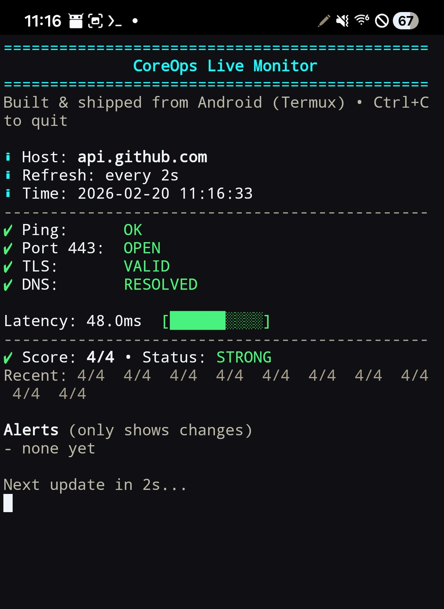
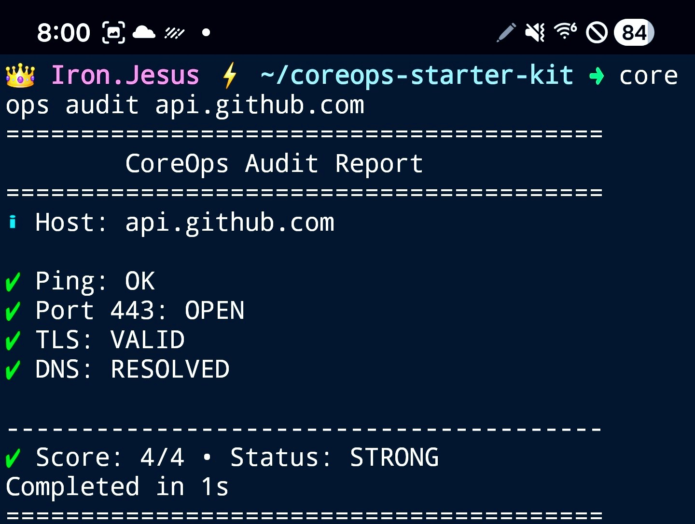

# CoreOps Starter Kit ⚡

## 🔴 Live Monitor Dashboard




Mobile-first DevOps & automation CLI built for Termux + minimal Linux.

**Fast. Portable. No bloat.**  
Run network + TLS checks, quick diagnostics, generate a system snapshot, and
audit web-page structure (CSS, JS, navigation, head tags, product pages,
checkout/PayPal integration) — all in seconds.

---

## ✨ Highlights
- ✅ Runs on Android (Termux) + Linux
- ⚡ Quick commands: `doctor`, `netcheck`, `portscan`, `sslcheck`, `snapshot`
- 🌐 `webaudit` — fetches any URL and scores its shared CSS, shared JS,
  navigation, head tags, product-card sections, and PayPal checkout integration
- 🛍️ Reusable [PayPal product-card component](#-paypal-product-card-component)
  (`components/paypal-product-card.html`) + shared assets
  (`assets/css/shared.css`, `assets/js/shared.js`)
- 🧩 Modular structure (easy to add new tools)
- 🧼 Minimal dependencies

---



## 🚀 Quick Start (Termux)

```bash
pkg update -y
pkg install -y git
git clone https://github.com/ironjesus74-hub/coreops-starter-kit.git
cd coreops-starter-kit
chmod +x bin/* modules/*.sh lib/*.sh install.sh
./install.sh
coreops help
```

---

## 🌐 Web Audit (`coreops webaudit`)

Fetches a URL and checks for the following:

| Category | Checks |
|---|---|
| **Shared CSS** | `<link rel="stylesheet">` present; `shared.css` referenced |
| **Shared JS** | `<script src="…">` present; `shared.js` referenced |
| **Navigation** | `<nav>` element; `role="navigation"` attribute |
| **Head tags** | `<title>`, `<meta name="description">`, `<meta name="viewport">`, `<link rel="canonical">` |
| **Product pages** | Product class/id/data attributes; `.coreops-product-card` / `product-card__` |
| **Checkout/PayPal** | Checkout section present; PayPal SDK loaded; `paypal.Buttons()` called |

```bash
coreops webaudit example.com
# or
coreops webaudit https://example.com/shop
```

Exit code is `0` when all checks pass, `1` when one or more checks fail.

---

## 🛍️ PayPal Product-Card Component

A fully self-contained, reusable product card with a standardised PayPal
checkout button lives at `components/paypal-product-card.html`.

**Replace** any hand-rolled, inconsistent PayPal button blocks in your HTML
pages with this single component.  Simply substitute the `[[ … ]]` placeholders
and include the shared assets in your page's `<head>`:

```html
<!-- In <head> of every page -->
<link rel="stylesheet" href="/assets/css/shared.css">
<script src="/assets/js/shared.js" defer></script>
```

Then drop in the component wherever you need a product card:

```html
<!-- Example: replace [[…]] with your own values -->
<div class="coreops-product-card" data-product="my-product">
  <!-- … see components/paypal-product-card.html for the full template … -->
</div>
```

### Placeholders

| Placeholder | Description |
|---|---|
| `[[PRODUCT_NAME]]` | Display name of the product |
| `[[PRODUCT_DESC]]` | Short description |
| `[[PRODUCT_PRICE]]` | Price string, e.g. `19.99` |
| `[[CURRENCY_CODE]]` | ISO 4217 currency code, e.g. `USD` |
| `[[PAYPAL_CLIENT_ID]]` | Your PayPal REST API client ID |
| `[[PAYPAL_ITEM_NAME]]` | URL-safe item name sent to PayPal |
| `[[PRODUCT_IMAGE_SRC]]` | Path or URL to the product image |
| `[[PRODUCT_IMAGE_ALT]]` | Alt text for the product image |

### Events

The component fires custom DOM events you can listen for on any ancestor:

```js
document.addEventListener('coreops:paypal:success', function(e) {
  console.log('Order captured', e.detail.orderId);
});
document.addEventListener('coreops:paypal:error', function(e) {
  console.error('Payment failed', e.detail.error);
});
```

Both events are already wired up in `assets/js/shared.js` with console
logging; override them in your page JS as needed.

---

## 📁 Repository layout

```
bin/
  coreops                  ← main entry point
lib/
  common.sh                ← shared shell utilities
  log.sh                   ← themed logging helpers
  theme.sh                 ← colour / icon definitions
modules/
  audit.sh                 ← host connectivity audit
  deps.sh                  ← dependency checker
  doctor.sh                ← system info
  live.sh                  ← live monitoring loop
  netcheck.sh              ← quick network ping check
  portscan.sh              ← TCP port scanner
  scan.sh                  ← quick host scan
  snapshot.sh              ← system snapshot to file
  sslcheck.sh              ← TLS/SSL certificate check
  webaudit.sh              ← ★ web-page structure auditor (new)
components/
  paypal-product-card.html ← ★ reusable PayPal product-card (new)
assets/
  css/shared.css           ← ★ shared stylesheet (new)
  js/shared.js             ← ★ shared JavaScript (new)
```
